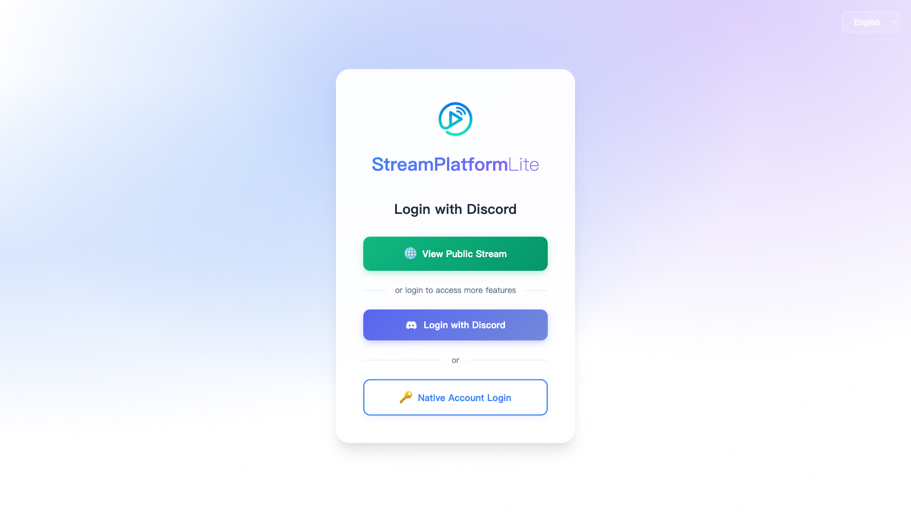
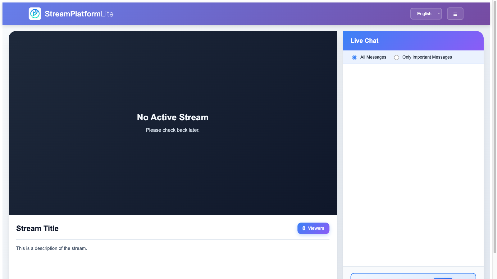
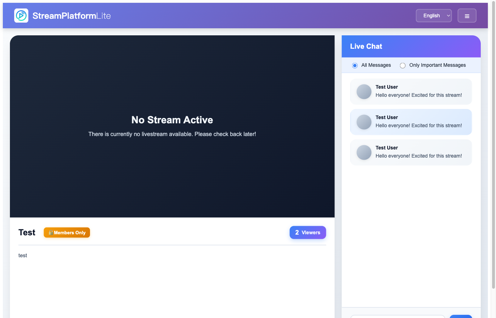
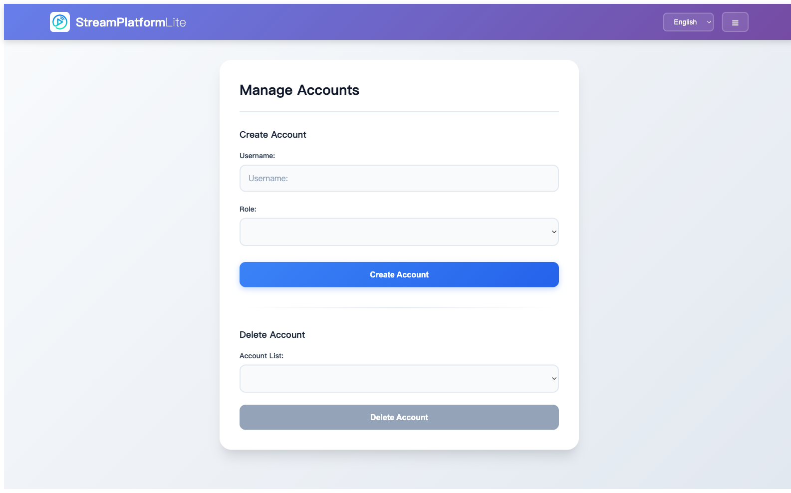
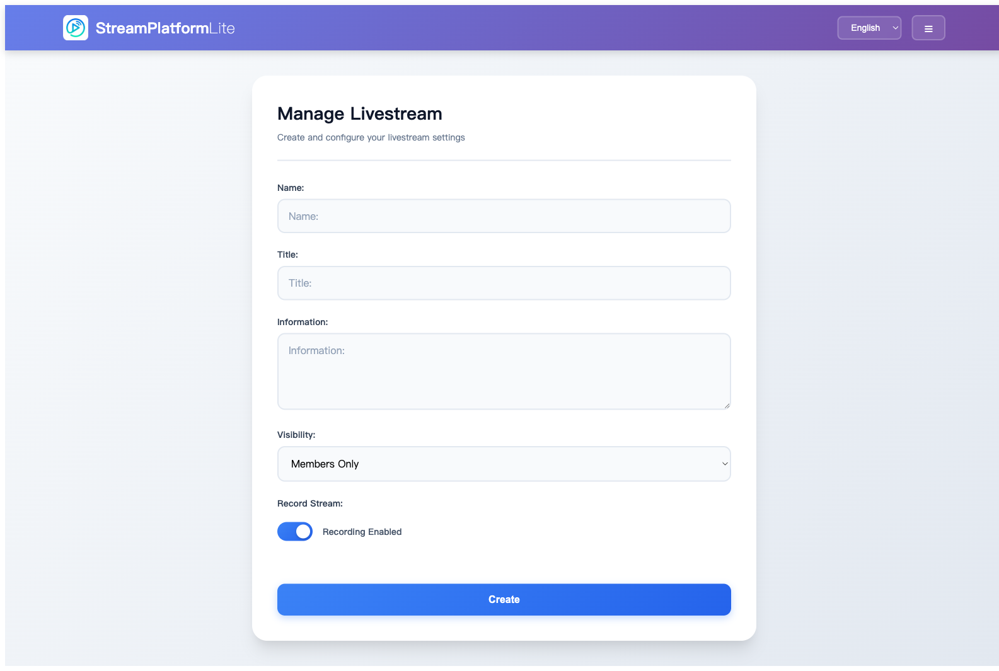
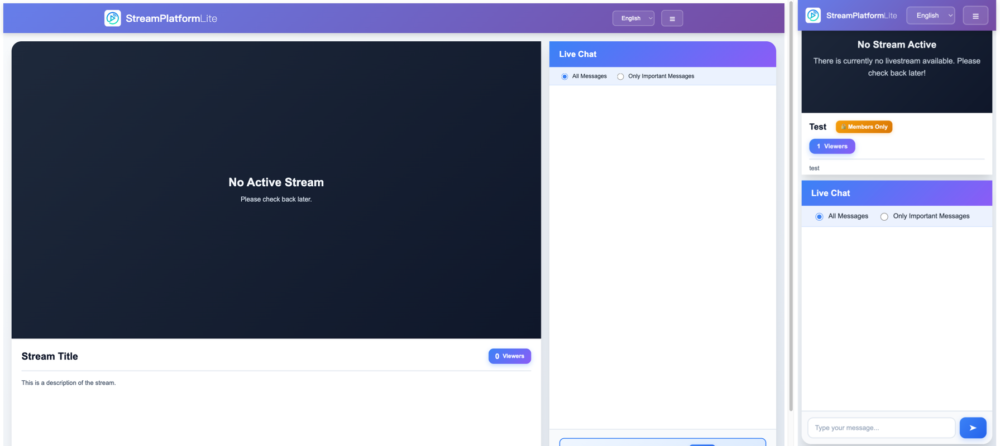

# StreamPlatformLite
Stream Platform Lite is a platform that allows any streamer to easily create their own live streaming platform, making their content and revenue not entirely dependent on major streaming platforms.

## Features

### Homepage & Navigation

<p align="center">
  
  <br/>
  <em>Clean and intuitive homepage with multi-language support</em>
</p>

- **Simple Navigation** - Easy access to live streams and authentication options
- **Discord OAuth Integration** - Quick login with Discord account
- **Language Selection** - Switch between English, Japanese, and Traditional Chinese

### Live Streaming & Broadcasting

<p align="center">
  
  <br/>
  <em>Real-time live streaming with chat and viewer count</em>
</p>

- **RTMP Push Streaming** - Stream directly from OBS or any RTMP-compatible software
- **Live Recording** - Optional recording functionality to save streams as MP4 files
- **Visibility Control** - Set streams as Public or Member Only
- **Real-time Viewer Count** - Accurate viewer statistics with anonymous user tracking

### Real-time Chat System

<p align="center">
  
  <br/>
  <em>Interactive chat with role-based permissions and moderation tools</em>
</p>

- **Live Chat** - WebSocket-powered real-time messaging
- **Message Filtering** - Toggle between viewing all messages or admin-only
- **User Avatars** - Display user identities with Discord avatars
- **Moderation Tools** - Delete messages and mute users based on role permissions
- **Chat History** - Redis-cached message history with pagination
- **Anonymous Chat Viewing** - Allow guests to view chat without logging in

### User Management & Authentication

<p align="center">
  
  <br/>
  <em>Comprehensive user management with role-based access control</em>
</p>

**Authentication Methods:**
- **Discord OAuth 2.0** - Seamless login with Discord account
- **Native Accounts** - Username/password authentication for system administrators

**Role-Based Access Control:**
| Feature | Admin | Editor | User | Guest | Anonymous |
|---------|-------|--------|------|-------|-----------|
| Manage users and accounts | ✓ | ✗ | ✗ | ✗ | ✗ |
| Manage livestreams | ✓ | ✗ | ✗ | ✗ | ✗ |
| Delete chat messages | ✓ | ✓* | ✓** | ✗ | ✗ |
| Mute users | ✓ | ✓* | ✗ | ✗ | ✗ |
| Watch member-only streams | ✓ | ✓ | ✓ | ✗ | ✗ |
| Send chat messages | ✓ | ✓ | ✓ | ✓ | ✗ |
| Watch public streams | ✓ | ✓ | ✓ | ✓ | ✓ |
| View chat messages | ✓ | ✓ | ✓ | ✓ | ✓ |

*Editor can only moderate User/Guest messages, not Admin/Editor messages

**Users can delete their own messages only

### Admin Dashboard

<p align="center">
  
  <br/>
  <em>Powerful admin interface for platform management</em>
</p>

**Livestream Management:**
- Create new livestreams with unique RTMP endpoints
- Edit stream titles, descriptions, and visibility settings
- Manage ban/mute lists for chat moderation
- Delete or archive past streams

**Account Management:**
- Create and delete native user accounts
- Assign user roles and permissions
- View all registered users and their details

**System Settings:**
- Configure Discord role mapping
- Set stream access permissions
- Customize platform behavior

### Internationalization & Responsive Design

<p align="center">
  
  <br/>
  <em>Fully responsive design with multi-language support</em>
</p>

- **Multi-language Support** - English, Japanese, Traditional Chinese with easy language switching
- **Mobile-Optimized** - Complete mobile experience with touch-friendly controls
- **Adaptive Layouts** - Optimized viewing on desktop and mobile devices

### Security & Performance

**Security Features:**
- CSRF protection with OAuth state validation
- HTTP-only cookies to prevent XSS attacks
- Bcrypt password encryption (10 rounds)
- JWT-based authentication with role verification
- CORS configuration for secure cross-origin requests

**Performance Optimizations:**
- Redis caching for chat messages and viewer counts
- File caching for accelerated HLS playback
- Concurrent lock mechanisms for video transcoding
- Automatic cleanup of expired cache entries

### Technical Highlights

**Frontend Stack:**
- Nuxt 3 + Vue 3 (Composition API)
- TypeScript for type safety
- Plyr + HLS.js for professional video playback
- Axios for API communication
- SweetAlert2 for beautiful notifications

**Backend Stack:**
- Go 1.22+ with Gin framework
- MongoDB for data persistence
- Redis for high-speed caching
- FFmpeg for video transcoding
- JWT for secure authentication

**Infrastructure:**
- Docker + Docker Compose for easy deployment
- Caddy for automatic HTTPS (Let's Encrypt)
- RTMP server for stream ingestion
- HLS for adaptive streaming delivery

## Deployment Options

StreamPlatformLite supports two deployment methods. **Caddy is recommended** for its simplicity and automatic HTTPS.

### Option 1: Caddy (Recommended - Automatic HTTPS)

**Advantages:**
- Automatic SSL certificate from Let's Encrypt
- Auto-renewal (no manual maintenance)
- Simpler configuration
- Better security (backend not directly exposed)
- HTTP/2 and HTTP/3 support out of the box

**Prerequisites:**
- Docker & Docker Compose
- Domain name with DNS A record pointing to your server
- Ports 80, 443, and 1935 open in firewall

**Setup:**

1. Clone the repositories:
    ```sh
    git clone https://github.com/cool9850311/StreamPlatformLite.git
    git clone https://github.com/cool9850311/StreamPlatformLite-Frontend.git
    git clone https://github.com/cool9850311/StreamPlatformLite-Backend.git
    ```

2. Navigate to the project directory:
    ```sh
    cd StreamPlatformLite
    ```

3. Copy the Caddy configuration files:
    ```sh
    cp docker-compose-caddy.yml docker-compose.yml
    cp Caddyfile.example Caddyfile
    ```

4. Edit `Caddyfile` and replace `example.com` with your actual domain name.

5. Update the environment variables in `docker-compose.yml`:
    - Replace `example.com` with your domain in `DOMAIN` and `FRONTEND_DOMAIN`
    - Update other environment variables as needed
    - (See [Configuration - docker-compose](https://github.com/cool9850311/StreamPlatformLite/wiki/Configuration-%E2%80%90-docker-compose))

6. Start the services:
    ```sh
    docker-compose up -d --build
    ```

7. Wait 1-2 minutes for Caddy to obtain SSL certificates automatically.

**Notes:**
- Certificates are stored in Docker volumes and renewed automatically
- No manual certificate management needed
- Access your site at `https://yourdomain.com`

### Option 2: Nginx (Traditional Method)

**Use this if:**
- You prefer manual certificate management
- You already have SSL certificates
- You need specific Nginx features

**Setup:**

1. Clone the repositories:
    ```sh
    git clone https://github.com/cool9850311/StreamPlatformLite.git
    git clone https://github.com/cool9850311/StreamPlatformLite-Frontend.git
    git clone https://github.com/cool9850311/StreamPlatformLite-Backend.git
    ```

2. Navigate to the project directory:
    ```sh
    cd StreamPlatformLite
    ```

3. Copy the example configuration files:
    ```sh
    cp docker-compose-example.yml docker-compose.yml
    cp nginx.conf.example nginx.conf
    ```

4. Update the environment variables in `docker-compose.yml` and `nginx.conf` as needed. (See [Configuration - docker-compose](https://github.com/cool9850311/StreamPlatformLite/wiki/Configuration-%E2%80%90-docker-compose))

5. Replace cert & key files in `certs` folder with your own SSL certificates.

6. Start the services using Docker Compose:
    ```sh
    docker-compose up -d --build
    ```

### Local HTTPS Testing

Test the full production stack (with HTTPS, strict CSP, security headers) on your local machine using [mkcert](https://github.com/FiloSottile/mkcert) and the `localtest.me` domain (automatically resolves to `127.0.0.1` via public DNS — no `/etc/hosts` needed).

**Prerequisites:**
- Docker & Docker Compose
- [mkcert](https://github.com/FiloSottile/mkcert): `brew install mkcert`

**Setup:**

1. Generate a locally-trusted certificate:
    ```sh
    mkdir -p local/certs
    mkcert -cert-file local/certs/cert.pem -key-file local/certs/key.pem localtest.me localhost 127.0.0.1
    ```

2. Copy the example config files:
    ```sh
    # Choose Caddy (recommended) or Nginx
    cp local/docker-compose.caddy.example.yml local/docker-compose.caddy.yml
    cp local/Caddyfile.example local/Caddyfile

    # Or for Nginx:
    cp local/docker-compose.nginx.example.yml local/docker-compose.nginx.yml
    cp local/nginx.example.conf local/nginx.conf
    ```

3. Fill in your credentials in `local/docker-compose.caddy.yml` (or `local/docker-compose.nginx.yml`):
    - `APP_SECRET_KEY`
    - `DISCORD_CLIENT_ID` / `DISCORD_CLIENT_SECRET` / `DISCORD_ADMIN_ID` / `DISCORD_GUILD_ID`

4. In the Discord Developer Portal, add `https://localtest.me/api/oauth/discord/callback` as a redirect URL.

5. Start the stack:
    ```sh
    # Caddy
    docker compose -f local/docker-compose.caddy.yml up --build -d

    # Or Nginx
    docker compose -f local/docker-compose.nginx.yml up --build -d
    ```

6. Access at **https://localtest.me**

**Notes:**
- RTMP push URL: `rtmp://localtest.me:1935/live/<stream-key>`
- Files inside `local/` that contain credentials (`docker-compose.caddy.yml`, `docker-compose.nginx.yml`, `Caddyfile`, `nginx.conf`) are gitignored

### Stopping the Application

To stop the services (works for both Caddy and Nginx):
```sh
docker-compose down
```

For more detailed information, refer to the individual repository links provided below.

## Frontend
[link](https://github.com/cool9850311/StreamPlatformLite-Frontend)

## Backend
[link](https://github.com/cool9850311/StreamPlatformLite-Backend)
